# Deploy a stack to a swarm
### Set up a Docker registry
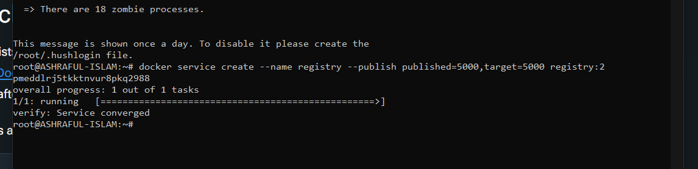

 ### Create the example application
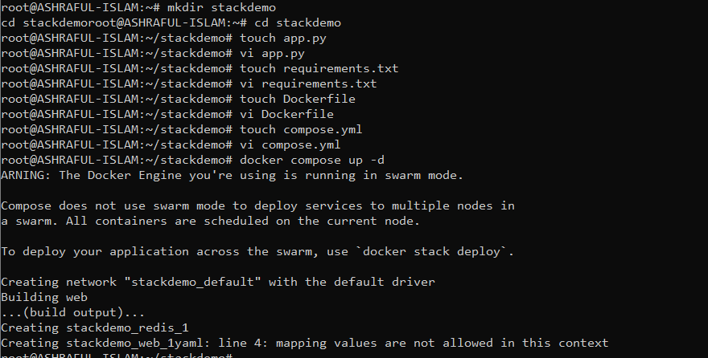

### Test the app with Compose
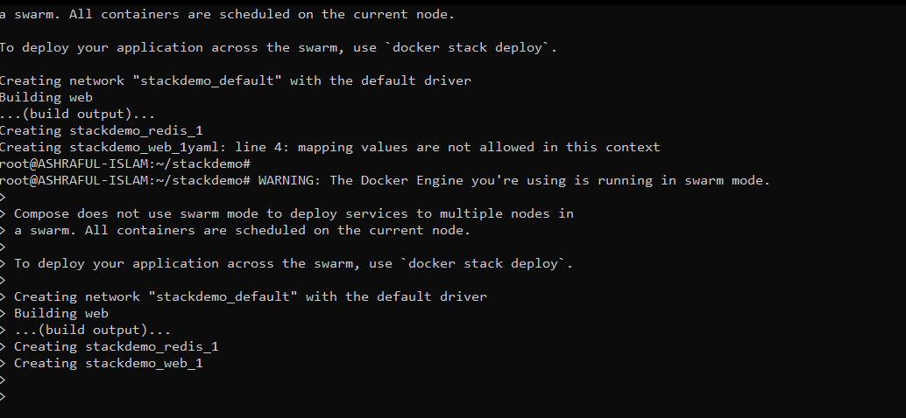

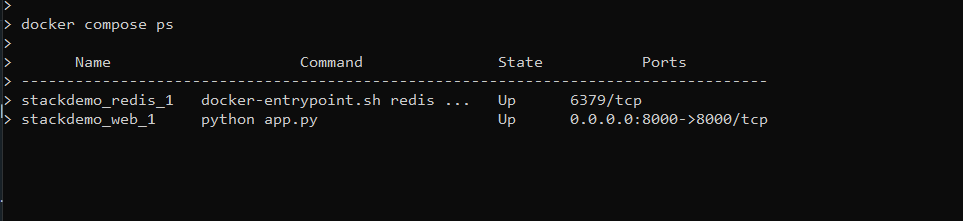

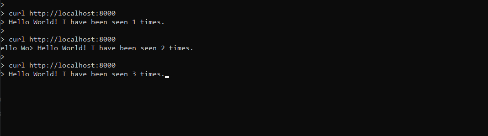

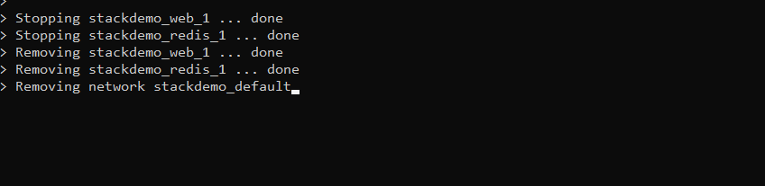

### Push the generated image to the registry
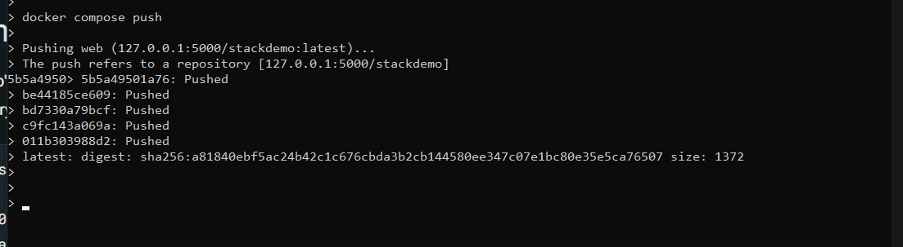

### Deploy the stack to the swarm
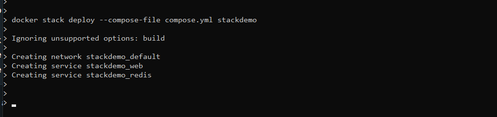

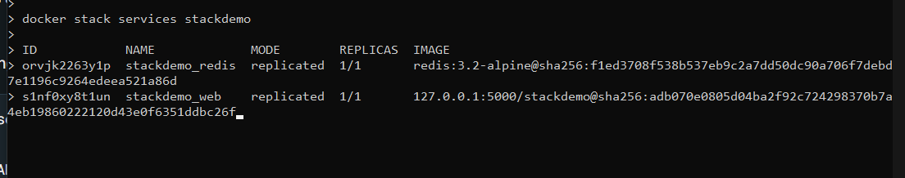

### Bring the stack down with docker stack rm:

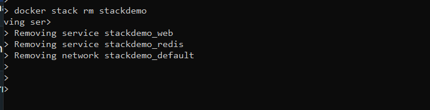

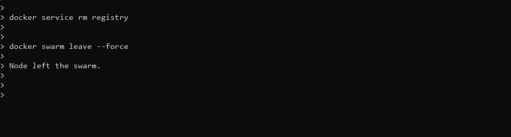

